<picture>
  <source media="(max-width: 600px)" srcset="./assets/capa-mobile.gif">
  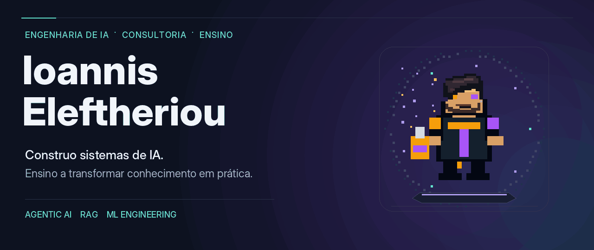
</picture>

**Senior AI Engineer · Consultor de IA · Professor de Machine Learning Engineering**

Desenvolvo aplicações de IA, arquiteturas de referência e experiências de formação técnica. Meus projetos conectam **agentes, conhecimento, software e pessoas** — do entendimento do problema à implementação, avaliação e aplicação no negócio.

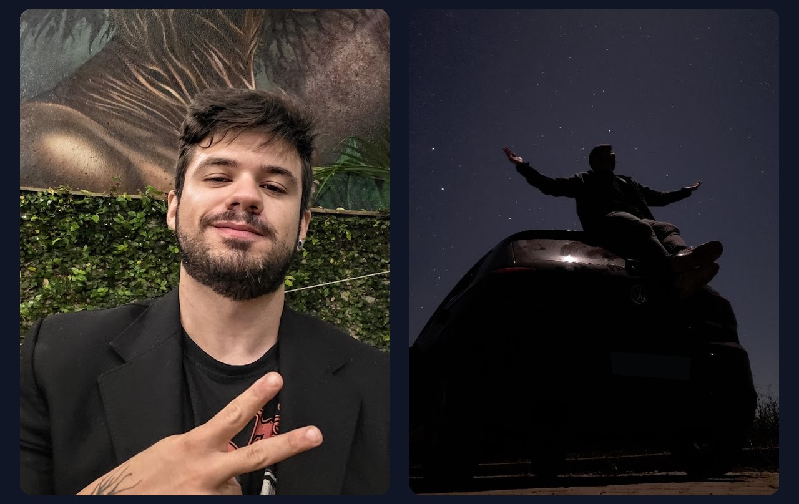

## Construir, compreender, compartilhar.

Sou Ioannis. Minha trajetória combina mais de dez anos em dados, crédito e serviços financeiros com engenharia de IA, consultoria e ensino. Essa base me ensinou a olhar tecnologia não apenas pelo que ela consegue fazer, mas pelo contexto em que precisa funcionar: negócio, dados, risco, operação e pessoas.

Minha formação em Design de Games acrescentou outra camada a essa visão. Sistema, narrativa e experiência visual não são acabamento: influenciam como estruturo uma aplicação, construo uma aula e transformo conceitos complexos em algo que possa ser compreendido, explorado e utilizado.

Hoje transito entre construção técnica e desenvolvimento de pessoas: desenho sistemas e arquiteturas de IA, mas também crio trilhas, workshops e mentorias para ajudar profissionais e equipes a desenvolver o repertório necessário para construir essas soluções com autonomia.

  

## O que desenvolvo

| IA aplicada | Engenharia e confiabilidade |
| :--- | :--- |
| Projetos com **agentes, RAG e sistemas multiagentes**: orquestração de estado, memória, ferramentas e conhecimento corporativo. | **APIs, serviços e aplicações de IA** com validação, containers, guardrails, avaliação, observabilidade e revisão humana. |

| Machine Learning e dados | Educação e estratégia |
| :--- | :--- |
| **Modelagem, analytics e automação**, conectando Python, CRISP-DM, preparação de dados, métricas e experimentação a problemas de negócio. | **Trilhas corporativas, workshops e mentorias** que combinam arquitetura, código, narrativa e prática. Também desenho currículos e apoio discovery, MVP e adoção de IA. |

## Stack

**Agentes, modelos e contexto**

  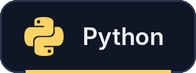
  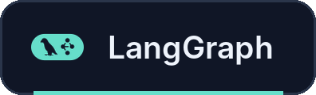
  
  
  
  
  
  

**Engenharia e operação**

  
  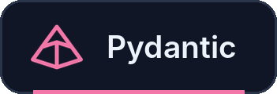
  
  
  
  

**Avaliação, proteção e dados**

  
  
  
  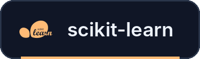
  
  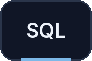

RAG · Context Engineering · MCP · Guardrails · Human-in-the-loop · MLOps / LLMOps

## Experiência que sustenta o trabalho

**Ensino, formação corporativa e mentoria**

  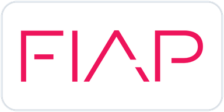
  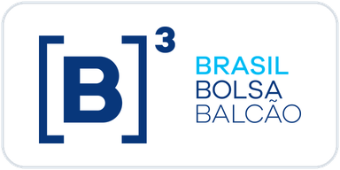
  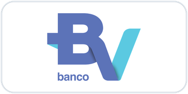
  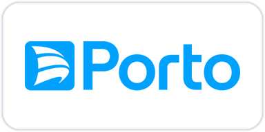
  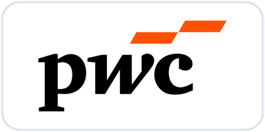
  

Levo esse repertório para públicos diferentes: desenvolvedores, profissionais de dados, equipes corporativas e lideranças. Em aulas e mentorias, conecto **fundamentos, arquitetura, prática e avaliação**, com materiais que continuam úteis depois do encontro.

**Minha base em dados e negócios**

  
  
  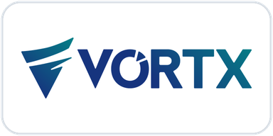
  
  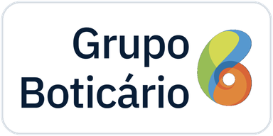

Essa trajetória passa por analytics, automação, crédito, cobrança, fundos, mercado de capitais e inteligência competitiva. É a base que levo para a engenharia e o ensino: **tecnologia conectada a operação, risco, valor e decisão**.

## Um pouco além do código

Tecnologia é uma parte importante do que faço, mas não é de onde tudo começa. Tenho uma relação antiga com jogos, narrativa, arte e construção de mundos, e isso ainda influencia bastante a forma como penso sistemas, ensino e crio.

Também gosto de sair do ambiente técnico e simplesmente explorar: viajar, fotografar, observar o céu, conhecer lugares e viver experiências que me tirem da rotina. Boa parte das ideias que levo para o trabalho nasce justamente dessa mistura entre curiosidade técnica e repertório vivido.

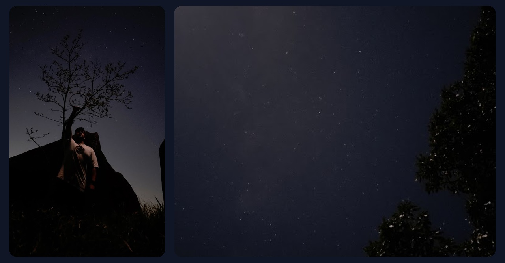

Sou bacharel em Design de Games pela Anhembi Morumbi e pós-graduado em  Data Science pela FIAP. Em 2018, recebi o 1º lugar no SBGames, na trilha de Artes & Design, com um trabalho sobre resignificação do espaço em mundos ficcionais.

Talvez por isso eu nunca tenha enxergado tecnologia apenas como ferramenta. Gosto de entender como as partes se conectam, que experiência um sistema produz e por que alguém deveria se importar com aquilo que estamos construindo.

Essa combinação entre engenharia, narrativa e pensamento visual continua presente no meu trabalho até hoje.

> No fundo, sou apenas um cara que gosta de aprender e dividir conhecimento.. e acredito que o papel da IA é expandir nossas capacidades e não limitá-las.

**Contatos para Consultoria · Formação corporativa · Workshops · Mentoria**  
[LinkedIn](https://www.linkedin.com/in/ioannispedroeleftheriou/) · [ioannis.eleftheriou.design@gmail.com](mailto:ioannis.eleftheriou.design@gmail.com)
